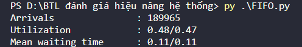
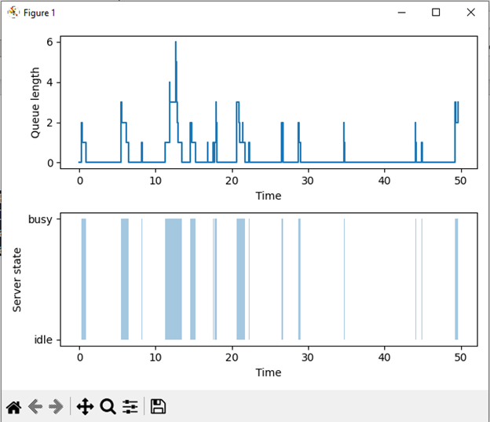
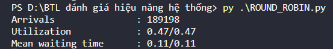
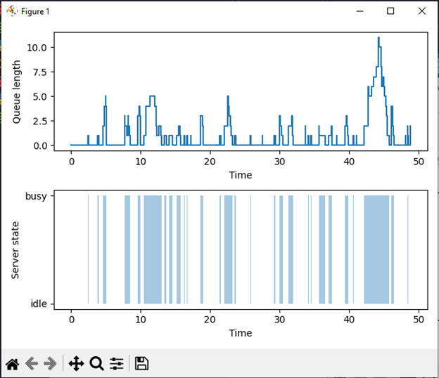

# DANH_GIA_HIEU_NANG_HE_THONG

    To run file FIFO.py, open powershell or terminal or cmd and input the command: 
    >> py FIFO.py
    The result might look something like:

Statistics:

Plot:

    To run file ROUND_ROBIN.py, open powershell or terminal or cmd and input the command: 
    >> py ROUND_ROBIN.py

    The result might look something like:

Statistics: 

Plot:

